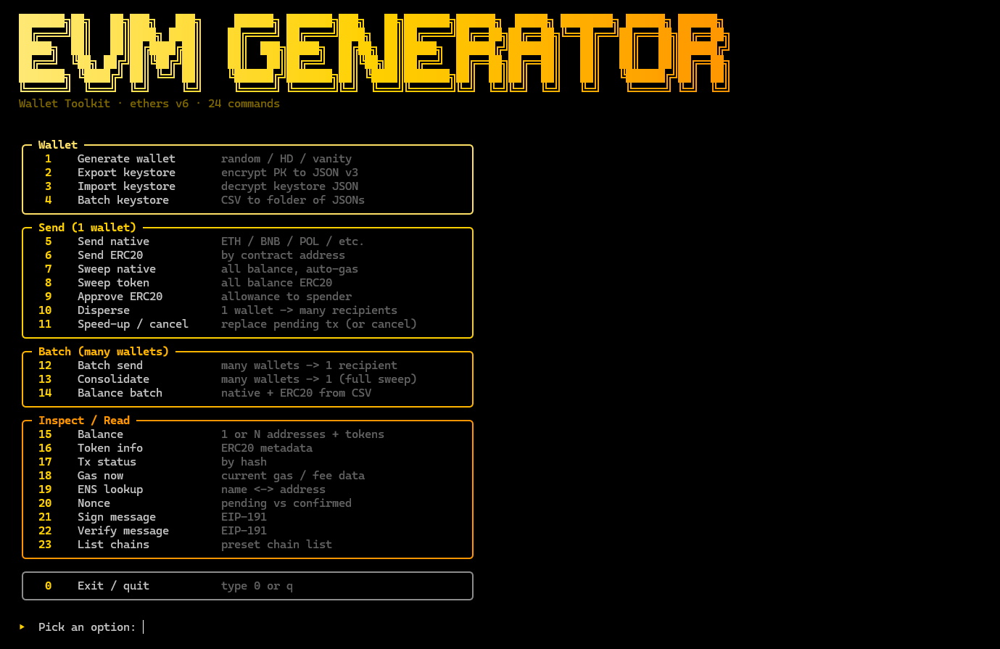

# EVM Generator


Interactive and scriptable EVM wallet toolkit for generating wallets, exporting encrypted keystores, checking balances, and sending native or ERC-20 transactions across common EVM chains.

Built with **Node.js** and **ethers v6**. No backend service is required: keys are generated and handled locally.

## Features

- Generate random wallets as CSV or JSON.
- Generate HD wallets from a mnemonic and derivation path.
- Import mnemonic/private key into address + private key output.
- Generate vanity addresses by prefix or suffix.
- Export/import encrypted keystore JSON v3.
- Batch-convert CSV private keys to keystore files.
- Send, sweep, approve, disperse, speed up, or cancel transactions.
- Batch-send and consolidate balances from many wallets.
- Inspect balances, token metadata, transactions, gas, ENS, nonces, and signatures.
- Preset RPCs for Ethereum, Base, BSC, Polygon, Arbitrum, Optimism, Avalanche, Linea, Scroll, zkSync, Sepolia, and Base Sepolia.

## Requirements

- Node.js 18 or newer
- npm

## Install

```bash
git clone https://github.com/exd77/evm-generator.git
cd evm-generator
npm install
chmod +x evm-wallet.js start.sh
```

## Usage

### Interactive menu

```bash
./start.sh
```

Running `./start.sh` opens a terminal-style menu like this:

<p align="center">
  
</p>

You can also pass a subcommand directly to skip the menu:

```bash
./start.sh help          # print subcommand list
./start.sh generate
./start.sh balance
./start.sh batch-send
```

### Direct CLI

```bash
node evm-wallet.js help
node evm-wallet.js <command> [options]
```

## Command overview

### Wallet

- `generate` — generate N random wallets.
- `generate-hd` — generate N HD wallets from one mnemonic.
- `import` — import wallet from `--mnemonic` or `--pk`.
- `vanity` — generate addresses with a prefix/suffix target.
- `keystore-export` — encrypt one private key to keystore JSON v3.
- `keystore-import` — decrypt and verify a keystore.
- `keystore-batch` — convert CSV private keys into keystore files.

### Send

- `send-native` — send ETH/BNB/POL/AVAX/etc.
- `send-token` — send ERC-20 by token contract.
- `sweep-native` — sweep native balance while accounting for gas.
- `sweep-token` — sweep ERC-20 balance.
- `approve` — approve ERC-20 allowance, including max approval.
- `disperse` — send from one wallet to many recipients from CSV.
- `speedup` — replace a pending transaction or cancel it.

### Batch

- `batch-send` — send the same amount from many wallets to one recipient.
- `consolidate` — sweep many wallets into one collector.
- `balance-batch` — check native and ERC-20 balances for many wallets.

### Inspect / read-only

- `chains` — list preset chains.
- `balance` — check balances for one address, multiple addresses, or CSV input.
- `token-info` — read ERC-20 name, symbol, decimals, and total supply.
- `tx-status` — inspect a transaction by hash.
- `gas-now` — show current fee data.
- `ens` — resolve ENS name ↔ address.
- `nonce` — show pending and confirmed nonce.
- `sign-message` — sign an EIP-191 message.
- `verify-message` — recover signer from an EIP-191 signature.

## Common options

### Network

```bash
--chain <key>           # ethereum, base, bsc, polygon, arbitrum, optimism, avalanche, linea, scroll, zksync, sepolia, base-sepolia
--rpc <url[,url2,...]>  # override RPC; multiple URLs use a fallback provider
--skip-chain-check      # skip chainId verification
```

### Private key sources

```bash
--pk <hex>              # direct private key; not recommended because it can appear in process lists
--pk-file <path>        # first line from a local file
--pk-env <NAME>         # private key from an environment variable
--keystore <path>       # encrypted keystore JSON
--password <value>      # keystore password; prefer prompt or --password-env
--password-env <NAME>   # keystore password from environment
EVM_PK                  # default fallback environment variable
```

### Output and transaction control

```bash
--out <path>            # write output file with mode 0600
--json                  # JSON output for wallet generation
--log <path>            # append batch logs
--wait                  # wait for confirmation
--dry-run               # print plan without broadcasting
--concurrency <n>       # parallel limit for batch operations
--retries <n>           # retry failed batch operations
```

### Gas / fee

```bash
--gas-price <gwei>      # legacy gasPrice
--max-fee <gwei>        # EIP-1559 maxFeePerGas
--priority-fee <gwei>   # EIP-1559 maxPriorityFeePerGas
--gas-limit <n>         # override gas limit
--nonce <n>             # override nonce
--auto-gas              # use provider fee data
--gas-multiplier <n>    # multiply automatic gas values
```

## Examples

Generate 100 random wallets:

```bash
node evm-wallet.js generate --count 100 --out wallets.csv
```

Generate HD wallets and save the master mnemonic separately:

```bash
node evm-wallet.js generate-hd --count 50 --out hd-wallets.csv --mnemonic-out master.txt
```

Generate vanity addresses:

```bash
node evm-wallet.js vanity --prefix dead --count 3 --out vanity.csv
```

Export a private key to encrypted keystore JSON:

```bash
node evm-wallet.js keystore-export \
  --pk-env EVM_PK \
  --password-env KEYSTORE_PASSWORD \
  --out keystore.json
```

Check a Base wallet balance:

```bash
node evm-wallet.js balance --chain base --address 0x0000000000000000000000000000000000000000
```

Check native + USDC balances for many wallets:

```bash
node evm-wallet.js balance-batch \
  --chain base \
  --csv wallets.csv \
  --tokens 0x833589fCD6eDb6E08f4c7C32D4f71b54bdA02913 \
  --out balances.csv
```

Dry-run a native transfer before broadcasting:

```bash
node evm-wallet.js send-native \
  --chain base \
  --keystore keystore.json \
  --to vitalik.eth \
  --amount 0.001 \
  --dry-run
```

Sweep native balance with automatic gas handling:

```bash
node evm-wallet.js sweep-native \
  --chain base \
  --pk-env EVM_PK \
  --to 0xCollector0000000000000000000000000000000000 \
  --auto-gas \
  --wait
```

## Safety notes

- Treat generated CSV/JSON wallet files, mnemonics, private keys, and keystores as secrets.
- Prefer `--pk-env`, `--pk-file`, or encrypted keystores over `--pk` on the command line.
- Always test transaction commands with `--dry-run` first.
- This repository ignores generated wallet/key material by default (`wallets*.csv`, `*.keystore`, `keystores/`, `peler`, `.env`, and related local files).
- Verify RPC endpoints and chain IDs before sending real funds.

## Project structure

```text
evm-wallet.js      # command dispatcher
start.sh           # interactive menu and wrapper
lib/chains.js      # chain presets
lib/provider.js    # RPC/provider setup
lib/wallet.js      # wallet generation and keystore commands
lib/send.js        # transaction commands
lib/batch.js       # batch send/consolidation/balance commands
lib/inspect.js     # read-only chain inspection commands
lib/pk.js          # private key and keystore loading
lib/csv.js         # CSV helpers
lib/util.js        # shared utilities
```

## Verification

```bash
npm install
node evm-wallet.js help
node evm-wallet.js chains
```
